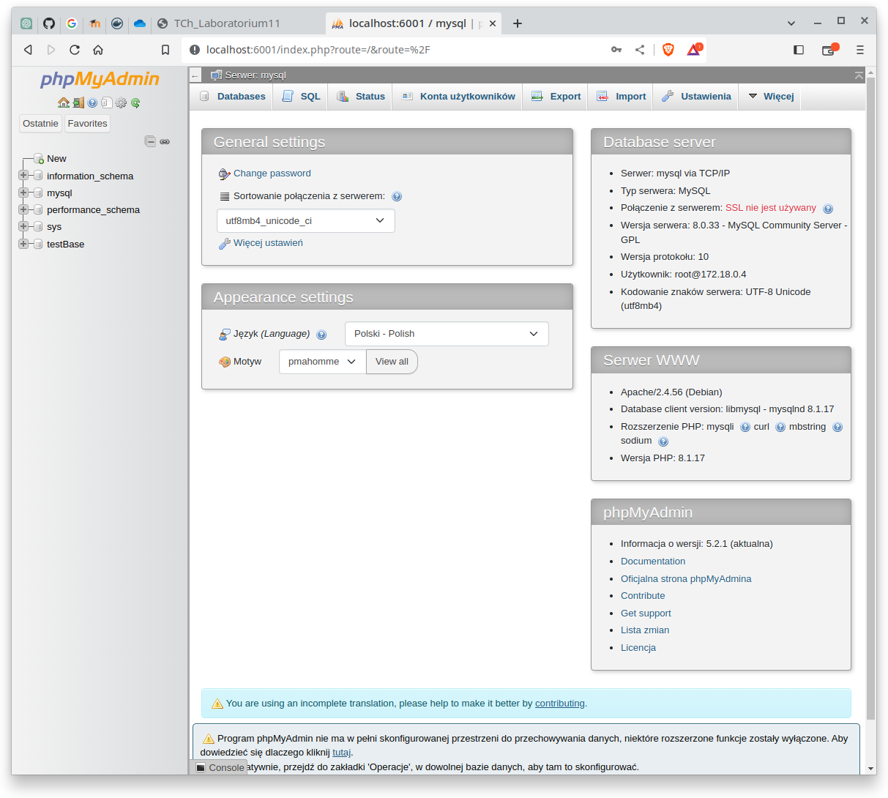
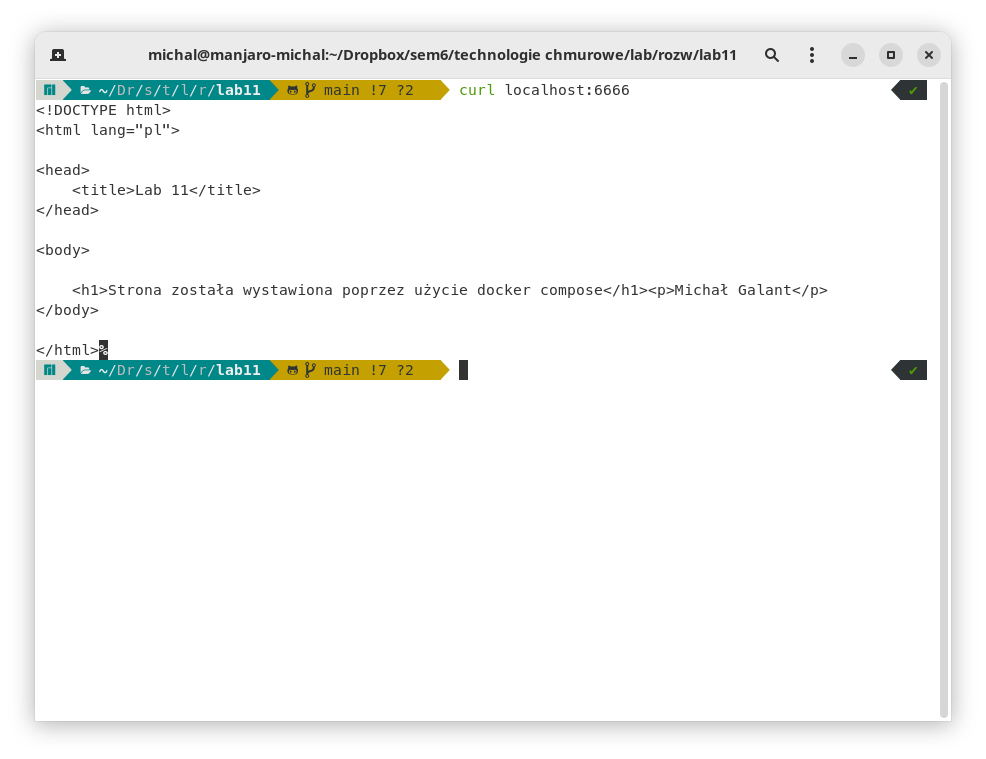
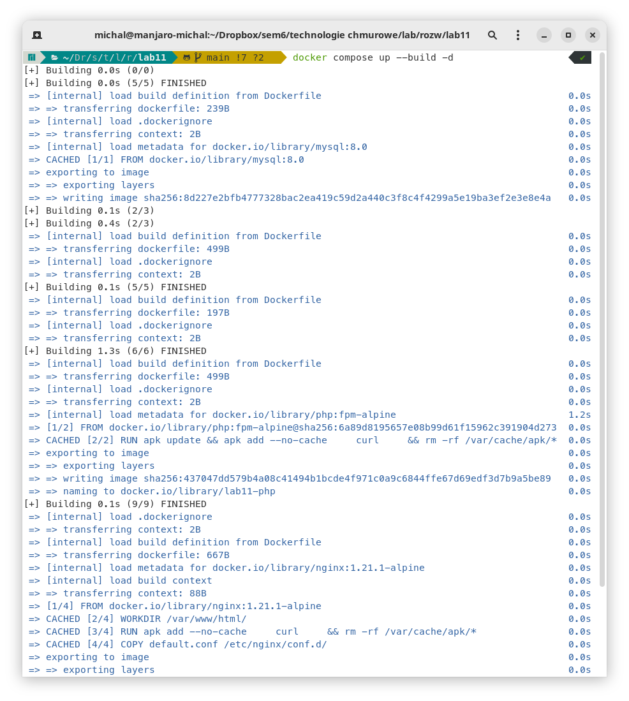
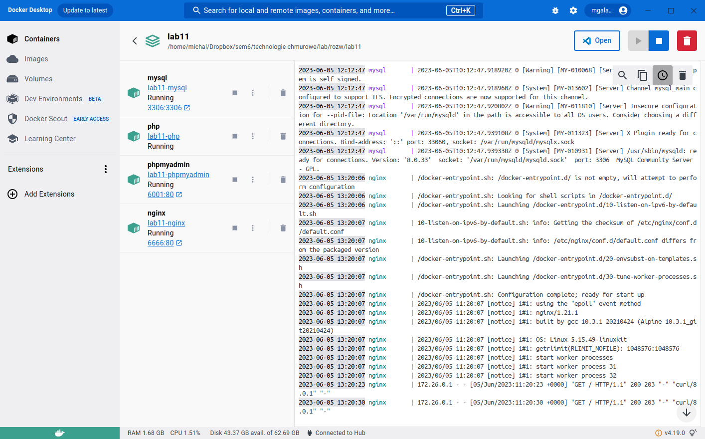

# chmury_lab11

Michał Galant

Sprawozdanie z laboratorium 11 z technologii chmurowych.

---

### 1. Działanie aplikacji

Połączenie z phpmyadmin


Połączenie z wystawioną stroną

Działanie sprawdzone komendą `curl localhost:6666`



---

### 2. Struktura aplikacji

#### 1. docker-compose.yaml

```yaml
#
# Michał Galant
#

version: "3"

# sekcja z konfiguracjami usług składowych
services:
  # konfiguracja usługi nginx
  nginx:
    container_name: nginx # nazwa kontenera
    # wskazanie folderu i dockerfile do zbudowania tego kontenera
    build:
      context: ./nginx
      dockerfile: Dockerfile
    # wksazanie powiązania z usługą php
    links:
      - php
    # ustawienie wolumenu z zawartością strony
    volumes:
      - ./php/:/var/www/html/
    # przekierowanie portów w kontenerze
    ports:
      - 6666:80
    # przyłączenie kontenera do sieci frontend i backed
    networks:
      - backend
      - frontend

  # konfiguracja usługi php
  php:
    container_name: php # nazwa kontenera
    # wskazanie folderu i dockerfile do zbudowania tego kontenera
    build:
      context: ./php
      dockerfile: Dockerfile
    # wystawienie kontenera na port 9000
    expose:
      - 9000
    # ustawienie wolumenu z zawartością strony
    volumes:
      - ./php/:/var/www/html/
    # przyłączenie kontenera do sieci backend
    networks:
      - backend

  # konfiguracja usługi mysql
  mysql:
    container_name: mysql # nazwa kontenera
    # wskazanie folderu i dockerfile do zbudowania tego kontenera
    build:
      context: ./mysql
      dockerfile: Dockerfile
    # ustawienie zmiennych środowiskowych dla tego kontenera
    environment:
      MYSQL_ROOT_PASSWORD: root # hasło do konta root
      MYSQL_DATABASE: test # nazwa bazy danych, która ma zostać utworzona
    # ustawienie przekierowania portów
    ports:
      - 3306:3306
    # przyłączenie kontenera do sieci backend
    networks:
      - backend

  # konfiguracja usługi phpmyadmin
  phpmyadmin:
    container_name: phpmyadmin # nazwa kontenera
    # wskazanie folderu i dockerfile do zbudowania tego kontenera
    build:
      context: ./phpmyadmin
      dockerfile: Dockerfile
    # ustawienie zmiennych środowiskowych dla tego kontenera
    environment:
      - PMA_ARBITRARY=1
      - PMA_HOST=mysql # nazwa kontenera, który obsługuje usługę mysql
    # utworzenie połączenia między tym kontenerem a bazą danych z usługi mysql
    links:
      - "mysql:test"
    # ustawienie przekierowania portów
    ports:
      - 6001:80
    # przyłączenie kontenera do sieci backend
    networks:
      - backend

# utworzenie sieci backend i frontend
networks:
  backend:
    driver: bridge
  frontend:
    driver: bridge
```

#### 2. mysql/Dockerfile

```dockerfile
# na bazie obrazu mysql w wersji 8.0
FROM mysql:8.0
# utworzenie wolumenu w kontenerze
VOLUME /var/lib/mysql
# wypuszczenie portu 3306
EXPOSE 3306
```

#### 3. nginx/Dockerfile

```dockerfile
# na bazie obrazu nginx w wersji 1.21.1-alpine
FROM nginx:1.21.1-alpine

# ustawienie katalogu roboczego
WORKDIR /var/www/html/

# aktualizacja systemu i instalacja curl
RUN apk add --no-cache \
    curl \
    && rm -rf /var/cache/apk/*

# skopiowanie konfiguracji serwera do kontenera
COPY default.conf /etc/nginx/conf.d/

# wypuszczenie portu 6666
EXPOSE 6666

# sprawdzanie stanu zdrowia kontenera
HEALTHCHECK --interval=30s --timeout=30s --start-period=5s --retries=3 \
    CMD [ "curl localhost:6666" ]

# uruchomienie serwera nginx
CMD [ "nginx", "-g", "daemon off;" ]
```

#### 4. nginx/default.conf

```conf
# właściwości serwera
server {
    # nasłuchuj na porcie 80
    listen 80;
    # nazwa serwera
    server_name localhost;

    root /var/www/html;
    # wczytanie plików aplikacji
    location / {
        index index.php index.html;
        try_files $uri $uri/ /index.php?$args =404;
    }

    # sekcja związana z wystawieniem plików .php na serwerze
    location ~ \.php$ {
        include fastcgi_params;
        fastcgi_pass php:9000;
        fastcgi_index index.php;
        fastcgi_param SCRIPT_FILENAME $document_root/$fastcgi_script_name;
    }
}
```

#### 5. phpmyadmin/Dockerfile

```dockerfile
# na bazie obrazu phpmyadmin w wersji 5
FROM phpmyadmin/phpmyadmin:5
# wypuszczenie portu 6001
EXPOSE 6001
```

#### 6. php/Dockerfile

```dockerfile
# na bazie obrazu php z fpm
FROM php:fpm-alpine

# aktualizacja systemu i instalacja pakietu curl
RUN apk update && apk add --no-cache \
    curl \
    && rm -rf /var/cache/apk/*

# wypuszczenie portu 9000
EXPOSE 9000

# sprawdzanie stanu zdrowia kontenera
HEALTHCHECK --interval=30s --timeout=30s --start-period=5s --retries=3 \
    CMD [ "curl localhost:9000" ]

# uruchomienie php-fpm
CMD [ "php-fpm" ]

```

#### 7. php/index.php

```php
<!DOCTYPE html>
<html lang="pl">
<head>
    <title>Lab 11</title>
</head>
<body>

    <?php
    $authorData = 'Michał Galant';

    echo '<h1>Strona została wystawiona poprzez użycie docker compose</h1>';
    echo '<p>' . $authorData . '</p>';
    ?>

</body>
</html>
```

---

### 3. Uruchomienie aplikacji

#### 1. Zbudowanie obrazu

`docker compose up --build -d`




